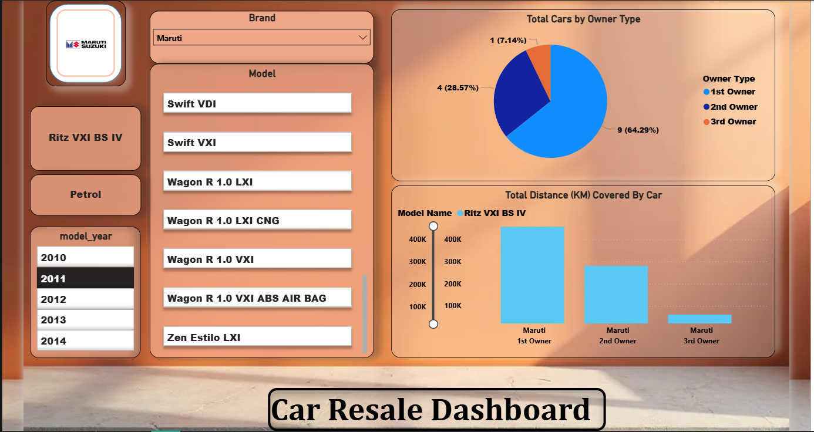

# Car Resale Insights Dashboard

## Overview
Designed and developed an interactive Power BI dashboard that provides deep insights into car resale trends across multiple brands and models. This tool helps dealerships and resellers analyze market patterns, ownership distributions, and resale values to support informed decision-making.

## Key Features
- **Brand & Model Level Filtering:** Drill down into specific car brands (e.g., Maruti, Mercedes, Toyota, Hyundai, Honda, Nissan, Tata) and models with year-wise analysis.
- **Ownership Type Analysis:** Visualizes ownership distribution across different categories and correlates it with total distance covered.
- **Dynamic Data Slicing:** Enables intuitive slicing and dicing of data for granular insights into resale trends by brand, model, year, and ownership type.
- **User-Friendly UI:** Emphasizes a clean and interactive design for enhanced usability and effective decision support.

## Business Impact
Empowers dealerships and resellers with actionable insights on market trends and resale value fluctuations, helping optimize pricing strategies and inventory management.

## Tools & Technologies
- Power BI  
- Data Analysis Expressions (DAX)

## Visual Preview

---

**Note:**  
Since this is a Power BI project, the primary file(s) will likely be `.pbix` files which GitHub can store but won’t render. Consider including screenshots or exported reports as images for better presentation.

